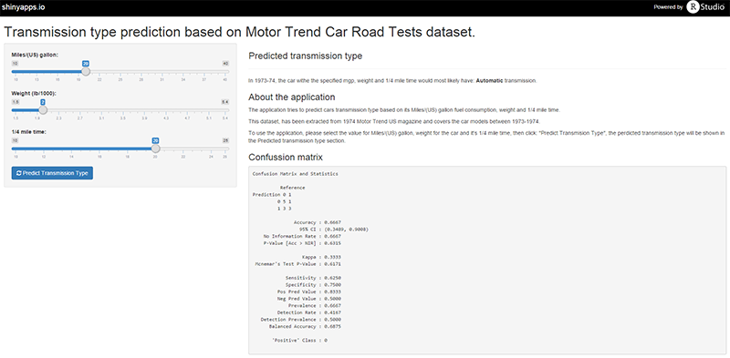

## Predicting car transmission type

1974 *Motor Trends* US magazine, using built model based on 32 automobiles (1973-74) models.

Tries to predict the transmission type based on *Miles/(US) gallon*, *Weight* and *1/4 mile time*.

--- 
## Screenshot



---
## *mtcars* dataset

Application for prediction uses a subset of *mtcars* dataset available in R datasets packages.

Prediction model is using:
```{r echo=FALSE}
library(datasets)
names(mtcars[, c(1, 6, 7)])
```

---
## Find it on
- Application, hosted on [shinyapps](https://masipauskas.shinyapps.io/web-app)
- Code on [github](https://github.com/masipauskas/coursera-developing-data-products/tree/master/web-app)
- This presentation, on [github](https://github.com/masipauskas/coursera-developing-data-products/tree/master/presentation)
