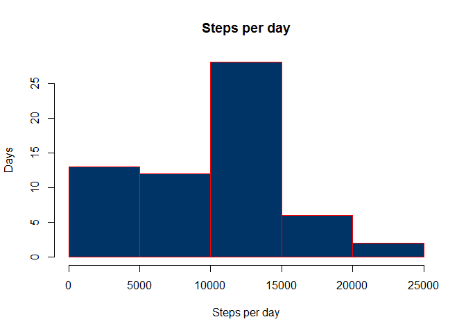

# Peer Assessment 1 - Analyzing activity monitoring data
Martynas Asipauskas  
14 June 2015  


## Abstract
This is a very high level analysis of activity monitoring data provided in `activity.zip` dataset.
Analysis is being done as a peer assessed coursework for Coursera - Reproducible Research course. 

`Activity` dataset contains a set of measurements collected between October and November, 2012 from Anonymous individual and contains number of steps taken in 5 minute intervals every day.

Summary of the dataset can be seen bellow:

```r
library(data.table)

activity <- read.csv(unz("activity.zip", filename = "activity.csv"))
activity$interval <- as.factor(activity$interval)
activity$date <- as.Date(activity$date)
activity <- data.table(activity)
summary(activity)
```

```
##      steps             date               interval    
##  Min.   :  0.00   Min.   :2012-10-01   0      :   61  
##  1st Qu.:  0.00   1st Qu.:2012-10-16   5      :   61  
##  Median :  0.00   Median :2012-10-31   10     :   61  
##  Mean   : 37.38   Mean   :2012-10-31   15     :   61  
##  3rd Qu.: 12.00   3rd Qu.:2012-11-15   20     :   61  
##  Max.   :806.00   Max.   :2012-11-30   25     :   61  
##  NA's   :2304                          (Other):17202
```

## What is mean total number of steps taken per day?
You can see the histogram of total number of steps taken per day between October and November bellow. 

```r
numberOfStepsPerDay <- as.data.frame(activity[, sum(steps, na.rm = TRUE), by = date])
hist(numberOfStepsPerDay$V1, main = "Steps per day", xlab = "Steps per day", ylab = "Days", col = "#003366", border = "red")
```

 


```r
meanNumberOfStepsTaken <- round(mean(numberOfStepsPerDay$V1), 2)
meanNumberOfStepsTaken
```

```
## [1] 9354.23
```

```r
medianNumberOfStepsTaken <- round(median(numberOfStepsPerDay$V1), 2)
medianNumberOfStepsTaken
```

```
## [1] 10395
```

The mean of steps taken in any given day is: *9354.23* steps. The meadian is: *1.0395\times 10^{4}* steps.

## What is the average daily activity pattern?

```r
averageNumberOfStepsPerInterval <- as.data.frame(activity[, mean(steps, na.rm = TRUE), by = interval])
plot(averageNumberOfStepsPerInterval$interval, averageNumberOfStepsPerInterval$V1, type = "l", xlab = "5-min interval", 
    ylab = "Number of Steps", main = "Average number of steps taken per 5-min interval", 
    col = "#003366", border = "red")
lines(averageNumberOfStepsPerInterval$interval, averageNumberOfStepsPerInterval$V1, col = "#003366")
```

 


```r
maxInterval <- averageNumberOfStepsPerInterval[which.max(averageNumberOfStepsPerInterval$V1),]$interval
```

The 5-min interval, during which the most steps are taken is: *835*.

# Imputing missing values
The `Activity` dataset contains quite a few missing values.


```r
nas <- sum(is.na(activity$steps))
nas
```

```
## [1] 2304
```

As can be seen from the summary above, the total number of missing values for steps is: *2304*. 

To fill in the missing values in this dataset, we will use a very simple strategy, where `NA` value will be replaced by the mean of the value in that interval.


```r
library(plyr)
activityNoNa <- data.table(ddply(activity, .(interval), function(df) {df$steps[is.na(df$steps)] <- mean(df$steps, na.rm=TRUE); return(df)}))
```


```r
numberOfStepsPerDayNoNa <- as.data.frame(activityNoNa[, sum(steps, na.rm = TRUE), by = date])
hist(numberOfStepsPerDayNoNa$V1, main = "Steps per day", xlab = "Steps per day", ylab = "Days", col = "#003366", border = "red")
```

 


```r
meanNumberOfStepsTakenNoNa <- round(mean(numberOfStepsPerDayNoNa$V1), 2)
meanNumberOfStepsTakenNoNa
```

```
## [1] 10766.19
```

```r
medianNumberOfStepsTakenNoNa <- round(median(numberOfStepsPerDayNoNa$V1), 2)
medianNumberOfStepsTakenNoNa
```

```
## [1] 10766.19
```

Once `NA` values have been filled in, the resulting mean of steps taken in any given day is: *1.076619\times 10^{4}* steps. The meadian is: *1.076619\times 10^{4}* steps. Which marks an increase of the mean by: *1411.96* and median by: *371.19* steps.

## Are there differences in activity patterns between weekdays and weekends?

```r
library(lattice)
activityNoNa$weekend <- as.factor(weekdays(activityNoNa$date) %in% c("Saturday", "Sunday"))
activityNoNa$weekend <- mapvalues(activityNoNa$weekend, from = c(TRUE, FALSE), to = c("Weekend", "Weekday"))

stepsPerDay <- aggregate(steps ~ interval + weekend, data = activityNoNa, mean)
xyplot(steps ~ interval | weekend, stepsPerDay, type = "l", layout = c(1, 2), 
    xlab = "Interval", ylab = "Number of steps")
```

 
